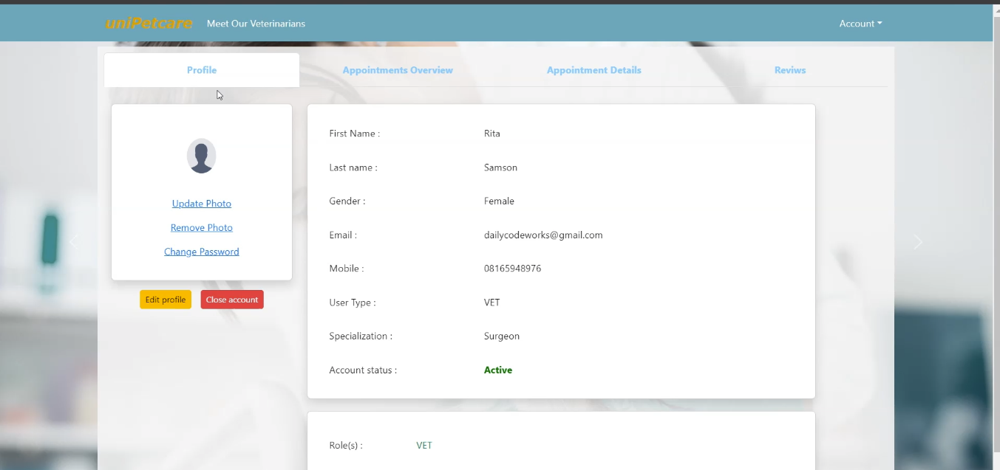
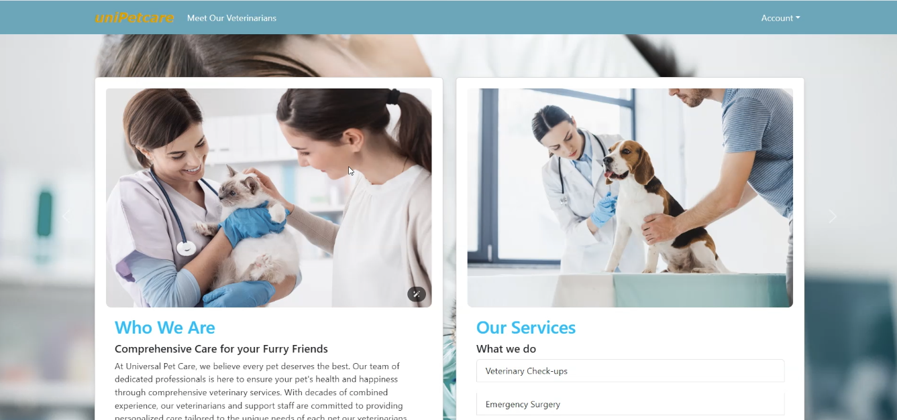
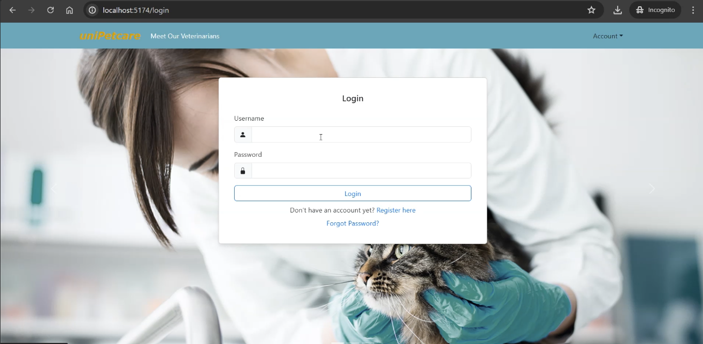

# Universal Pet Care

Universal Pet Care is a comprehensive platform designed to manage and monitor the care of pets. It includes features like scheduling, tracking pet health, and more. The project is built using React and Vite, with several libraries integrated for additional functionality.

## Table of Contents

- [Features](#features)
- [Installation](#installation)
- [Usage](#usage)
- [Screenshots](#screenshots)
- [Scripts](#scripts)
- [Dependencies](#dependencies)

## Features

- **Pet Management**: Keep track of multiple pets, including their health records and schedules.
- **Interactive UI**: Built using React and Bootstrap for a responsive and user-friendly interface.
- **Data Visualization**: Uses Recharts for visualizing data like pet health stats over time.
- **Secure Authentication**: JWT-based authentication to ensure secure access to the platform.

## Installation

1. **Clone the Repository**:
    ```bash
    git clone https://github.com/Shanks2121/universal-pet-care.git
    cd universal-pet-care
    ```

2. **Install Dependencies**:
    ```bash
    npm install
    ```

3. **Start the Development Server**:
    ```bash
    npm run dev
    ```

## Usage

- **Development**: To start the development server, use `npm run dev`. This will launch the application in development mode with hot-reloading.
- **Build**: To create a production-ready build, use `npm run build`. The output will be in the `dist/` directory.
- **Linting**: To ensure code quality, use `npm run lint`. This command checks for linting errors based on the configured ESLint rules.
- **Preview**: After building the project, you can preview it using `npm run preview`.

## Screenshots

Here are some screenshots of the Universal Pet Care application:

1. **Screenshot 1**:
   

2. **Screenshot 2**:
   

3. **Screenshot 3**:
   

## Scripts

- `npm run dev`: Starts the development server on port 5174.
- `npm run build`: Builds the application for production.
- `npm run lint`: Runs ESLint to check for code issues.
- `npm run preview`: Previews the production build.

## Dependencies

- **React**: ^18.2.0
- **Axios**: ^1.7.2
- **Bootstrap**: ^5.3.3
- **Date-fns**: ^3.6.0
- **JWT Decode**: ^4.0.0
- **React-Bootstrap**: ^2.10.2
- **React-Datepicker**: ^6.9.0
- **React-DOM**: ^18.2.0
- **React-Icons**: ^5.2.1
- **React-Icons-Kit**: ^2.0.0
- **React-Router-DOM**: ^6.23.1
- **Recharts**: ^2.12.7

### Dev Dependencies

- **@types/react**: ^18.2.66
- **@types/react-dom**: ^18.2.22
- **@vitejs/plugin-react**: ^4.2.1
- **ESLint**: ^8.57.0
- **eslint-plugin-react**: ^7.34.1
- **eslint-plugin-react-hooks**: ^4.6.0
- **eslint-plugin-react-refresh**: ^0.4.6
- **Vite**: ^5.2.0

## Backend Server

The backend server for this project is available at [Universal Pet Care Backend](https://github.com/Shanks2121/pet-care-backend).

